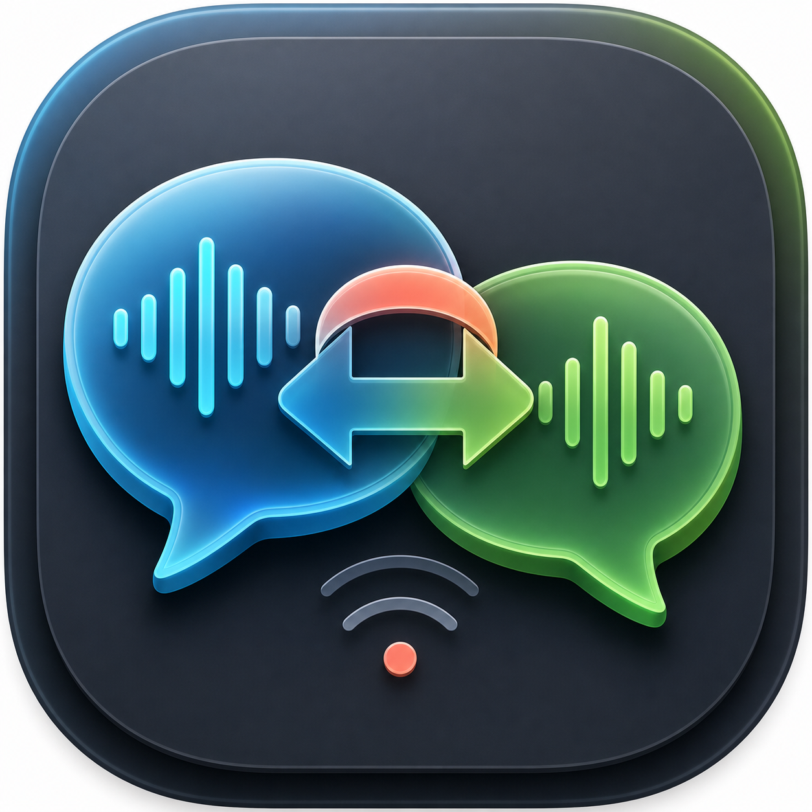
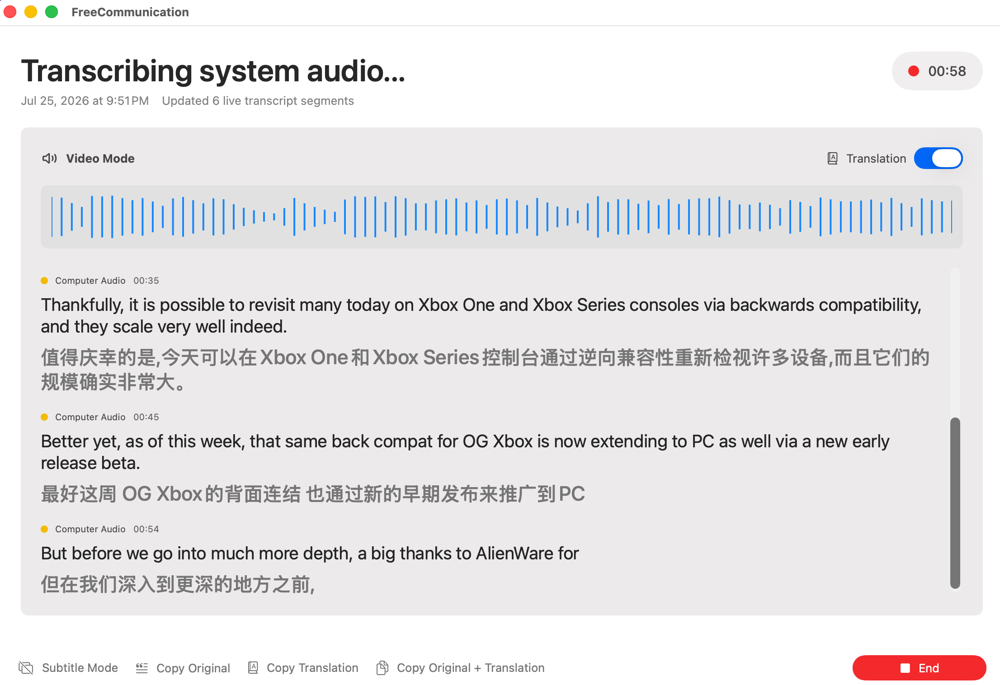
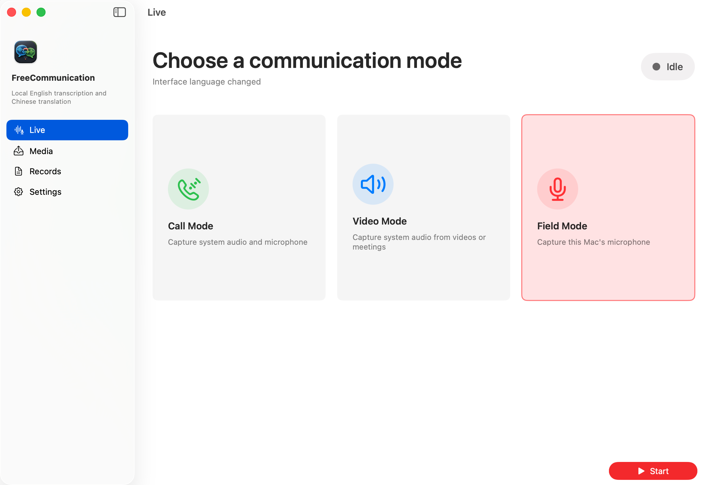
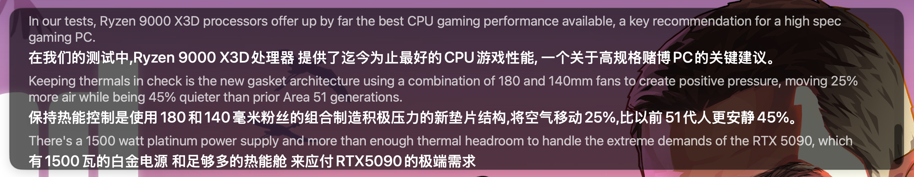
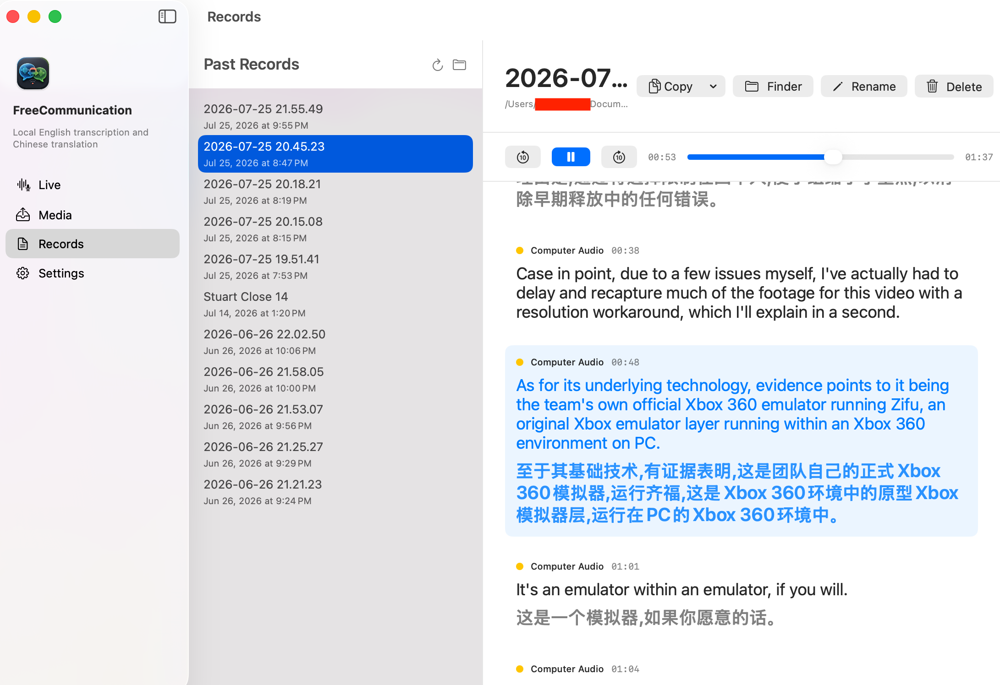
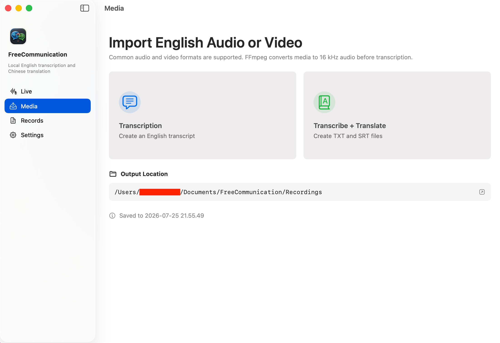
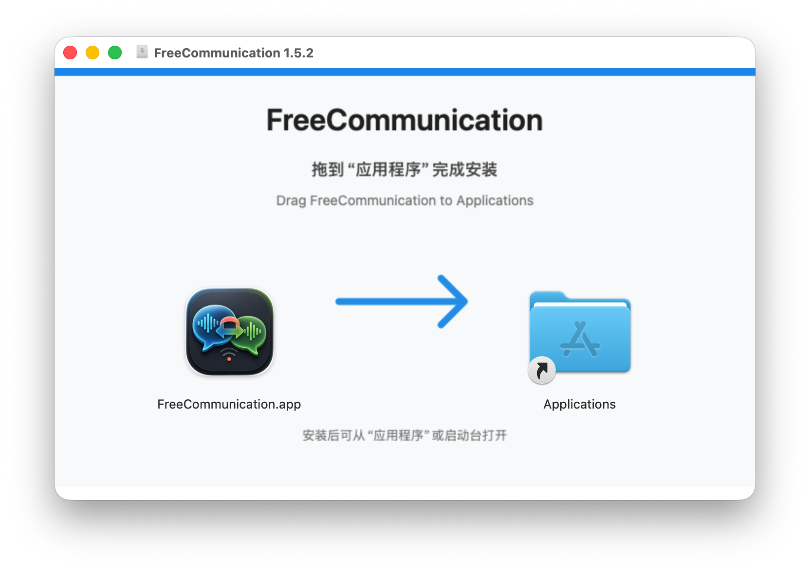

<div align="center">
  
  <h1>FreeCommunication</h1>
  <p><strong>Local, real-time English transcription and Chinese translation for Apple Silicon Macs.</strong></p>
  <p>
    <strong>English</strong> ·
    <a href="README.zh-CN.md">简体中文</a>
  </p>
  <p>
    
    
    
    
  </p>
</div>

> [!IMPORTANT]
> FreeCommunication is **source-available for noncommercial use** under the
> [PolyForm Noncommercial License 1.0.0](LICENSE). Commercial use requires
> separate written permission from ScorpioDai. Because this license restricts
> commercial use, it is not an OSI-approved open-source license.

> [!NOTE]
> Speech and translation models are not included in the app, DMG, or source
> repository. FreeCommunication downloads them from Hugging Face on demand, or
> you can install them manually.

## Overview

FreeCommunication turns English speech into a live English transcript and,
when enabled, a Simplified Chinese translation. Audio capture, ASR, translation,
record creation, and playback all run locally on the Mac. Network access is
used only when downloading model repositories from Hugging Face.



### Highlights

- Three live workflows for calls, system audio, and in-person communication.
- True streaming ASR using the Nemotron cache-aware streaming implementation.
- Stable live paragraph limits prevent unpunctuated speech from becoming one
  unreadable transcript block.
- Translation can be switched on or off mid-session without interrupting ASR.
- The warmed translation model remains resident for instant resumption.
- Real audio-level waveform that settles when the selected source is silent.
- Normal transcript view and a resizable, always-on-top subtitle window.
- Immediate Simplified Chinese and English interface switching.
- Import common audio/video files for transcription or bilingual output.
- TXT records, archived 16 kHz WAV audio, and SRT for imported media.
- Synced record playback with active-segment highlighting and click-to-seek.
- Original, translation, and bilingual copy actions in live and saved records.
- Local records can be renamed, deleted, or revealed directly in Finder.

## Live Modes

| Mode | Captures | Best for |
| --- | --- | --- |
| **Call Mode** | System audio + microphone | Video meetings and calls |
| **Video Mode** | System audio only | English videos, streams, and presentations |
| **Field Mode** | Microphone only | In-person conversations, lectures, and interviews |



Call Mode includes a microphone hot switch. Experimental system echo
cancellation is available in **Settings → Recording** and is disabled by
default because it can reduce microphone sensitivity. Headphones are
recommended for calls to prevent speaker audio from re-entering the microphone.
Channel labels identify the audio source, not individual speakers; this release
does not perform speaker diarization.

## Subtitle Mode

Subtitle Mode changes the live transcript into a translucent, floating strip
above the Dock. It can join all Spaces and appear over full-screen content.

- Drag anywhere on the background to move it.
- Resize the panel from its edges.
- Hover to reveal microphone, translation, opacity, font-size, and end controls.
- Scroll up to pause automatic following; return to the bottom to resume it.
- English and Chinese use the same typography ratio as the normal transcript.
- Ending the live session also closes the floating subtitle window.

Live ASR prefers sentence-ending punctuation when creating a new paragraph. If
the recognizer emits a long unpunctuated stream, FreeCommunication starts a new
paragraph at a stable upper bound of 36 words or 240 characters. The text is
split, never discarded.



## Records And Playback

Every completed live session is stored in:

```text
~/Documents/FreeCommunication/Recordings
```

A folder-backed live record normally contains:

```text
YYYY-MM-DD HH.mm.ss/
├── transcript.txt
└── audio.wav
```

The Records view supports play/pause, 10-second skip controls, timeline seeking,
automatic scrolling, active transcript highlighting, and clicking a transcript
segment to jump the audio to that time. It also provides copy, rename, delete,
and Finder actions. Legacy top-level TXT records remain readable.



## Imported Media

Choose **Media** and then:

- **Transcription** to create English-only output.
- **Transcribe + Translate** to create bilingual TXT and SRT output.

FFmpeg converts supported media to mono 16 kHz audio before inference. Common
audio and video containers supported by the bundled FFmpeg build can be used.
Imported records use the source filename as their base name and are saved as a
folder under the Records directory.

```text
Source file name/
├── transcript.txt
└── subtitles.srt
```

SRT segments are divided into compact, viewing-friendly cues with refined
timestamps. Imported-media processing uses fast offline transcription rather
than the live streaming session.



## Requirements

### Minimum

- Apple Silicon Mac. Intel Macs are not supported by the distributed build.
- macOS 14 or newer.
- About 5 GB of free disk space for the app, both complete model repositories,
  downloads in progress, and working files.
- Microphone permission for Call and Field Modes.
- Screen & System Audio Recording permission for Call and Video Modes.
- Documents-folder access for models and records.

### Recommended

- M-series Mac with 16 GB or more unified memory.
- Headphones for Call Mode.
- A stable connection that can reach `huggingface.co` and its redirected model
  storage endpoints during initial model installation.

### Tested Environment

- MacBook Pro with Apple M1 Pro.
- 16 GB unified memory.
- macOS 26.
- ASR on MLX/Metal and NMT on CPU.

macOS 26 is the primary tested system. The app declares macOS 14 as its minimum
deployment target, but not every intermediate OS and hardware combination has
received the same amount of hands-on testing.

## Install The App

1. Download `FreeCommunication-1.5.2.dmg` from
   [GitHub Releases](https://github.com/ScorpioDai/FreeCommunication/releases/latest).
2. Open the DMG.
3. Drag **FreeCommunication.app** onto the **Applications** folder icon.
4. Eject the disk image and launch FreeCommunication from Applications.
5. Grant the requested Documents, Microphone, and Screen & System Audio
   Recording permissions for the modes you plan to use.



The current community build is ad-hoc signed and is not Apple-notarized. On
first launch after an internet download, macOS may show a developer trust
warning. Control-click the app in Applications, choose **Open**, and confirm
only if the DMG came from this repository. Developer ID signing and notarization
are planned for a future distribution.

## Install Models

Both repositories are public and ungated at the time of this release; the app
does not require a Hugging Face account or access token.

| Purpose | Repository | Local folder | Upstream license |
| --- | --- | --- | --- |
| Streaming English ASR | [animaslabs/nemotron-speech-streaming-en-0.6b-mlx-8bit](https://huggingface.co/animaslabs/nemotron-speech-streaming-en-0.6b-mlx-8bit) | `~/Documents/AI Models/animaslabs:nemotron-speech-streaming-en-0.6b-mlx-8bit` | See derivative card and NVIDIA base-model terms |
| English → Chinese NMT | [Helsinki-NLP/opus-mt-en-zh](https://huggingface.co/Helsinki-NLP/opus-mt-en-zh) | `~/Documents/AI Models/Helsinki-NLP:opus-mt-en-zh` | Apache 2.0 |

### Automatic Download

1. Start any live mode, or open **Settings → Models**.
2. Accept the model-download prompt.
3. Keep the app open while both progress indicators finish.
4. Select **Check Backend** after both models show Ready.

Interrupted downloads use `.part` files and resume when retried. The automatic
installer mirrors each complete repository. The NMT repository therefore
contains PyTorch, TensorFlow, Flax, and Rust weight formats; FreeCommunication
currently uses `pytorch_model.bin` on CPU.

If downloads remain at zero, fail repeatedly, or cannot reach Hugging Face,
verify that your network can access the model pages and redirected storage
hosts. FreeCommunication intentionally does not include a secondary mirror.

### Manual Download

The app checks fixed folders so manually downloaded repositories must keep the
exact names shown above. One option is the official Hugging Face CLI:

```bash
python3 -m pip install -U huggingface_hub

hf download animaslabs/nemotron-speech-streaming-en-0.6b-mlx-8bit \
  --local-dir "$HOME/Documents/AI Models/animaslabs:nemotron-speech-streaming-en-0.6b-mlx-8bit"

hf download Helsinki-NLP/opus-mt-en-zh \
  --local-dir "$HOME/Documents/AI Models/Helsinki-NLP:opus-mt-en-zh"
```

You may also obtain the same repositories by another tool or mirror, then move
the complete files into those exact folders. Required files are checked in
**Settings → Models → Check Backend**.

## Using A Live Session

1. Select Call, Video, or Field Mode.
2. Select **Start** and wait for the model-loading message to change to live
   streaming status. Audio capture starts after model warm-up.
3. Toggle Translation at any time. Existing translated segments remain visible;
   new segments switch smoothly between English-only and bilingual layouts.
4. In Call Mode, use the microphone hot switch when needed.
5. Copy the current original, translation, or bilingual transcript at any time.
6. Enter Subtitle Mode for an unobtrusive overlay.
7. Select **End**. The final streaming buffer is flushed, then the transcript
   and captured audio are written without re-transcribing the whole meeting.

The **live chunk** control in Settings ranges from 2 to 12 seconds and affects
capture archival/fallback behavior. The streaming recognizer itself consumes
PCM incrementally rather than waiting for complete chunks.

## Settings

- **General:** hot-switch between Simplified Chinese and English.
- **Models:** view model names, installation state, progress, fixed storage
  folders, and backend health.
- **Recording:** open the Records folder, choose the live chunk duration, and
  opt into experimental Call Mode echo cancellation.
- **Subtitles:** set shared transcript/subtitle opacity and font size.

Paths are built from the active macOS home directory. A path such as
`/Users/alex/Documents/...` will automatically use each Mac account's real
username; `scorpio-dai` is not hard-coded.

## Privacy And Data

- Recognition and translation inference run locally.
- Captured audio and transcripts are not uploaded by FreeCommunication.
- Clipboard actions use the macOS pasteboard.
- Model download is the only built-in network workflow.
- Deleting a folder-backed record removes its transcript, audio, and subtitle
  files together. Keep independent backups for important meetings.

ASR and machine translation can be inaccurate. Review critical names, numbers,
legal statements, medical information, and decisions against the source audio.

## Architecture

| Layer | Implementation |
| --- | --- |
| macOS UI | SwiftUI with narrow AppKit window/panel interop |
| System audio | ScreenCaptureKit |
| Microphone/audio archive | AVFoundation and bundled FFmpeg |
| Streaming ASR | Python, MLX, MLX Audio, and Nemotron ASR on Metal |
| Translation | Transformers/PyTorch OPUS-MT on CPU |
| Model download | Native URLSession manifest lookup and `/usr/bin/curl` |
| Record playback | AVPlayer with timestamped transcript segments |

ASR is kept on the Apple GPU while NMT runs on CPU to reduce GPU-bandwidth
contention during live recognition. The packaged app embeds the Python/MLX
runtime and portable FFmpeg libraries, which explains its roughly 1.1 GB
installed size. Models remain external.

## Build From Source

Prerequisites:

- Full Xcode or compatible Swift 6 toolchain.
- Python 3.10 or newer.
- FFmpeg available while creating the backend environment.
- Apple Silicon Mac.

```bash
git clone https://github.com/ScorpioDai/FreeCommunication.git
cd FreeCommunication

./script/setup_backend.sh
./script/build_and_run.sh --verify
./script/package_dmg.sh
```

Outputs:

```text
dist/FreeCommunication.app
dist/FreeCommunication-1.5.2.dmg
```

The app build copies the Python environment and `Vendor/FFmpeg` into the bundle
but never copies `~/Documents/AI Models`.

## Tests

```bash
swift test
./script/core_logic_smoke.sh
Backend/.venv/bin/python Backend/test_backend_logic.py
Backend/.venv/bin/python script/stream_translation_smoke.py \
  --input "/path/to/english-audio-or-video"
hdiutil verify dist/FreeCommunication-1.5.2.dmg
```

`swift test` requires an Xcode toolchain that provides XCTest. The smoke tests
cover model-state logic, safe downloads, waveform behavior, typography, stable
live paragraph splitting without text loss, live translation policy, long-text
translation splitting, streaming state, and SRT cue generation. Real microphone
and ScreenCaptureKit behavior should also be checked manually because macOS
permissions and available audio devices are system-dependent.

## Known Limitations

- English speech recognition and English-to-Simplified-Chinese translation only.
- No individual-speaker diarization.
- Experimental Call Mode echo cancellation can reduce microphone sensitivity.
- The public DMG is not yet Developer ID signed or notarized.
- Model quality, bias, and permitted uses remain subject to each upstream model.
- Intel Macs and macOS versions older than 14 are unsupported.

## Contributing

Noncommercial improvements are welcome. Read [CONTRIBUTING.md](CONTRIBUTING.md)
before opening an issue or pull request. By contributing, you agree that your
contribution may be distributed under the project's existing license.

## License And Third-Party Terms

FreeCommunication's original source code is licensed under
[PolyForm Noncommercial 1.0.0](LICENSE). Personal, educational, charitable, and
other noncommercial uses permitted by that license are allowed. Commercial use
or commercial redistribution requires separate written permission from
[ScorpioDai](https://github.com/ScorpioDai).

The models, FFmpeg, Python packages, Apple frameworks, names, and trademarks are
not relicensed by this project. See [THIRD_PARTY_NOTICES.md](THIRD_PARTY_NOTICES.md).

Copyright © 2026 ScorpioDai.
